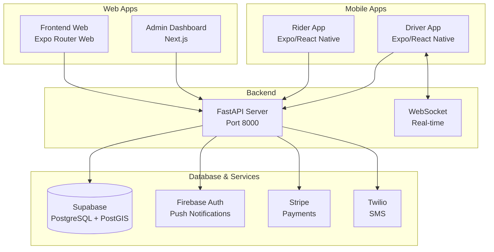
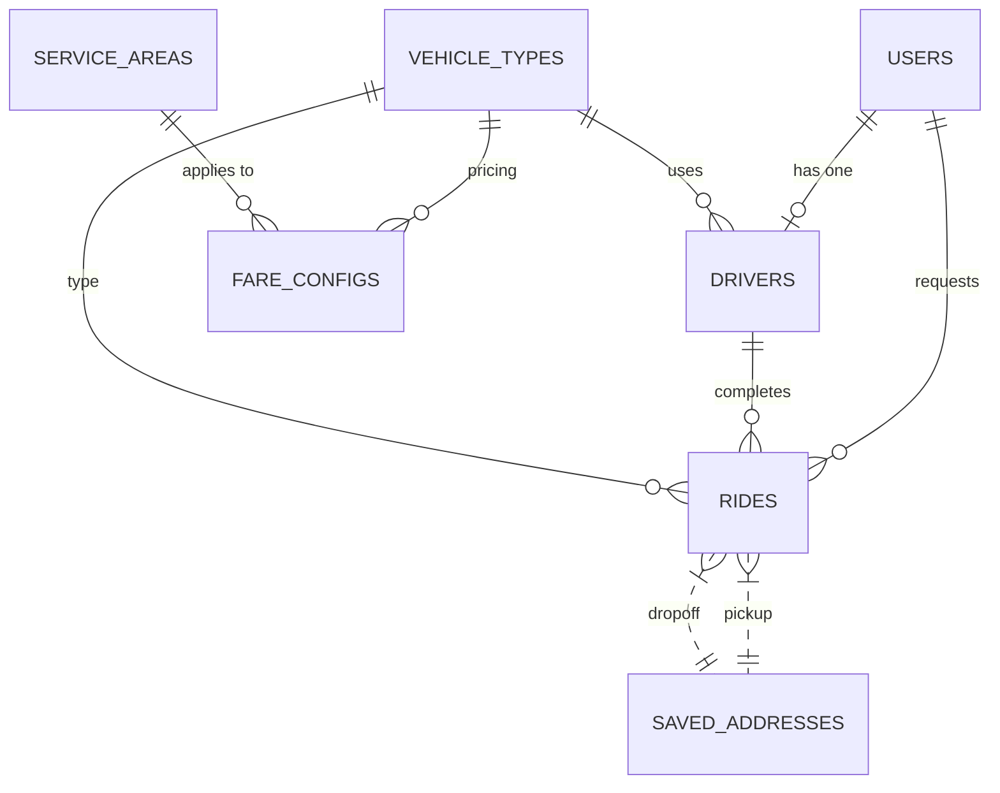

# Spinr Rideshare Application - Comprehensive Code Analysis

## Executive Summary

Spinr is a complete rideshare platform built with a modern technology stack. The system consists of four main components:
1. **Backend** - Fast API (Python) with Supabase/PostgreSQL
2. **Driver App** - Expo/React Native (Mobile)
3. **Rider App** - Expo/React Native (Mobile)
4. **Admin Dashboard** - Next.js (Web)
5. **Frontend/Web** - Expo/React Native (Web)

---

## Architecture Overview



---

## Component Analysis

### 1. Backend (Fast API)

**Location:** `spinr/backend/`

#### Key Files:
- [`server.py`](spinr/backend/server.py) - Main API server (~3800 lines)
- [`db.py`](spinr/backend/db.py) - Database abstraction layer
- [`db_supabase.py`](spinr/backend/db_supabase.py) - Supabase integration
- [`features.py`](spinr/backend/features.py) - Extended features
- [`documents.py`](spinr/backend/documents.py) - Document management
- [`sms_service.py`](spinr/backend/sms_service.py) - SMS/OTP service

#### Technology Stack:
- **Framework:** FastAPI 0.110.0+
- **Database:** Supabase (PostgreSQL with PostGIS)
- **Authentication:** JWT + Firebase
- **Real-time:** WebSocket (custom implementation)
- **Payments:** Stripe
- **SMS:** Twilio
- **Maps:** Google Maps API

#### API Endpoints (49 endpoints):

**Authentication:**
- `POST /api/auth/send-otp` - Send OTP
- `POST /api/auth/verify-otp` - Verify OTP & login
- `GET /api/auth/me` - Get current user
- `POST /api/users/profile` - Create/update profile

**Rides (Rider):**
- `POST /api/rides` - Create ride request
- `GET /api/rides` - Get ride history
- `GET /api/rides/{ride_id}` - Get ride details
- `POST /api/rides/{ride_id}/cancel` - Cancel ride
- `POST /api/rides/{ride_id}/rate` - Rate driver
- `POST /api/rides/estimate` - Estimate fare

**Rides (Driver):**
- `GET /api/drivers/rides/pending` - Get pending ride requests
- `GET /api/drivers/rides/active` - Get active ride
- `POST /api/drivers/rides/{ride_id}/accept` - Accept ride
- `POST /api/drivers/rides/{ride_id}/decline` - Decline ride
- `POST /api/drivers/rides/{ride_id}/arrive` - Mark arrived
- `POST /api/drivers/rides/{ride_id}/verify-otp` - Verify OTP
- `POST /api/drivers/rides/{ride_id}/start` - Start ride
- `POST /api/drivers/rides/{ride_id}/complete` - Complete ride

**Driver Management:**
- `POST /api/drivers/register` - Register as driver
- `GET /api/drivers/me` - Get driver profile
- `POST /api/drivers/status` - Toggle online status
- `GET /api/drivers/earnings` - Get earnings
- `GET /api/drivers/earnings/daily` - Daily earnings
- `POST /api/drivers/location-batch` - Batch location updates

**Other:**
- `GET /api/vehicle-types` - Get vehicle types
- `GET /api/fares` - Get fare estimates
- `POST /api/payments/create-intent` - Create payment intent
- `GET /api/nearby-drivers` - Find nearby drivers
- `WS /ws/{client_id}` - WebSocket for real-time updates

#### Database Schema:

**Core Tables:**
- `users` - Rider and driver user accounts
- `drivers` - Driver profiles with vehicle info
- `rides` - Ride transactions
- `vehicle_types` - Vehicle categories
- `service_areas` - Geofenced service areas
- `fare_configs` - Pricing configuration
- `otp_records` - OTP verification
- `saved_addresses` - User saved locations
- `settings` - App settings
- `support_tickets` - Customer support
- `surge_pricing` - Dynamic pricing

#### Strengths:
✅ Comprehensive REST API with 49 endpoints
✅ PostGIS integration for geospatial queries
✅ JWT + Firebase dual authentication
✅ Real-time WebSocket support
✅ Rate limiting (slowapi)
✅ Stripe payment integration
✅ Scheduled rides support
✅ Support ticket system

#### Issues Identified:
⚠️ Large server.py file (3800+ lines) - should be split into modules
⚠️ CORS allows all origins (`allow_origins=["*"]`)
⚠️ Hardcoded JWT secret in development mode
⚠️ No API versioning
⚠️ Some duplicate code between db.py and db_supabase.py

---

### 2. Driver App (Expo/React Native)

**Location:** `spinr/driver-app/`

#### Technology Stack:
- **Framework:** Expo SDK 54 / React Native 0.81.5
- **Navigation:** Expo Router v5 (file-based routing)
- **State Management:** Zustand
- **Maps:** react-native-maps 1.20.1
- **Location:** expo-location
- **Storage:** expo-secure-store, AsyncStorage
- **HTTP Client:** Axios

#### Key Screens:
- [`app/login.tsx`](spinr/driver-app/app/login.tsx) - Phone login
- [`app/otp.tsx`](spinr/driver-app/app/otp.tsx) - OTP verification
- [`app/become-driver.tsx`](spinr/driver-app/app/become-driver.tsx) - Driver registration
- [`app/driver/index.tsx`](spinr/driver-app/app/driver/index.tsx) - Main dashboard with map
- [`app/driver/rides.tsx`](spinr/driver-app/app/driver/rides.tsx) - Ride history
- [`app/driver/earnings.tsx`](spinr/driver-app/app/driver/earnings.tsx) - Earnings view
- [`app/driver/profile.tsx`](spinr/driver-app/app/driver/profile.tsx) - Driver profile
- [`app/driver/ride-detail.tsx`](spinr/driver-app/app/driver/ride-detail.tsx) - Active ride details

#### State Management:
- [`store/driverStore.ts`](spinr/driver-app/store/driverStore.ts) - Ride state machine

**Ride State Machine:**
```
idle → ride_offered → navigating_to_pickup → 
arrived_at_pickup → trip_in_progress → trip_completed
```

#### Key Features:
✅ Real-time location tracking
✅ Ride offer acceptance/decline
✅ OTP verification
✅ In-app navigation to pickup
✅ Earnings dashboard
✅ Push notifications support

#### Issues Identified:
⚠️ WebSocket connection not implemented in driver store
⚠️ Location updates sent individually, not batched
⚠️ No offline mode for critical data
⚠️ Error handling could be more robust

---

### 3. Rider App (Expo/React Native)

**Location:** `spinr/rider-app/`

#### Technology Stack:
- Same as Driver App (Expo SDK 54)

#### Key Screens:
- Login/OTP flow
- Home screen with map
- Ride booking flow
- Ride tracking
- Payment confirmation
- Rating

#### Issues Identified:
⚠️ Similar issues to Driver App
⚠️ Need to verify WebSocket implementation

---

### 4. Frontend Web (Expo Router)

**Location:** `spinr/frontend/`

This appears to be a web-based version of the rider app using Expo Router's web capabilities.

#### Key Structure:
- `app/` - Expo Router pages
- `app/(driver)/` - Driver-specific screens
- `app/(tabs)/` - Tab navigation
- `store/` - Zustand stores
- `api/` - API client
- `components/` - Reusable components
- `config/` - Configuration

---

### 5. Admin Dashboard (Next.js)

**Location:** `spinr/admin-dashboard/`

#### Technology Stack:
- **Framework:** Next.js 16.1.6
- **UI:** React 19 + Tailwind CSS 4
- **Components:** Radix UI + shadcn/ui
- **Maps:** Leaflet + react-leaflet
- **Icons:** Lucide React

#### Key Pages:
- `src/app/dashboard/page.tsx` - Main dashboard
- `src/app/dashboard/drivers/page.tsx` - Driver management
- `src/app/dashboard/rides/page.tsx` - Ride management
- `src/app/dashboard/pricing/page.tsx` - Fare configuration
- `src/app/dashboard/vehicle-types/page.tsx` - Vehicle types
- `src/app/dashboard/service-areas/page.tsx` - Geofencing
- `src/app/dashboard/earnings/page.tsx` - Earnings reports
- `src/app/dashboard/surge/page.tsx` - Surge pricing
- `src/app/dashboard/documents/page.tsx` - Document verification

#### Components:
- `src/components/driver-map.tsx` - Driver location map
- `src/components/geofence-map.tsx` - Service area editor

#### Strengths:
✅ Modern Next.js App Router architecture
✅ Beautiful UI with shadcn/ui components
✅ Geofence map editor with Leaflet
✅ Document management system

#### Issues Identified:
⚠️ Uses Next.js 16.1.6 (very new, may have bugs)
⚠️ No authentication implementation visible
⚠️ API calls directly from components (no proper API layer)

---

### 6. Shared Configuration

**Location:** `spinr/shared/`

- [`shared/config/spinr.config.ts`](spinr/shared/config/spinr.config.ts) - App configuration
- [`shared/api/client.ts`](spinr/shared/api/client.ts) - Axios HTTP client

#### Configuration:
- Backend URL detection (env var, host URI, localhost)
- Firebase configuration (disabled by default)
- Twilio configuration (disabled by default)
- Phone regex for Canadian numbers
- Design system colors and typography

---

## Integration Points

### Authentication Flow:
1. User enters phone number
2. Backend generates OTP (stored in `otp_records`)
3. User enters OTP
4. Backend verifies and returns JWT
5. Token stored in expo-secure-store
6. All subsequent requests include Bearer token

### Ride Booking Flow:
1. Rider enters pickup/dropoff
2. Backend calculates fare using `fare_configs`
3. Nearby drivers found using PostGIS `find_nearby_drivers`
4. Ride created with `status='searching'`
5. Drivers receive ride offer via WebSocket
6. First driver to accept gets the ride
7. Ride progresses through states
8. Payment processed on completion

### Driver Location Updates:
1. Driver app tracks location with expo-location
2. Location sent to backend via `/api/drivers/location-batch`
3. Backend updates `drivers` table
4. Location available for rider to see

---

## Database Schema (PostgreSQL)

### Key Tables with Relationships:



---

## Security Considerations

### Current Implementation:
- ✅ JWT token authentication
- ✅ Rate limiting on auth endpoints
- ✅ Secure token storage (expo-secure-store)
- ✅ CORS middleware

### Recommendations:
1. **CORS** - Restrict origins in production
2. **JWT Secret** - Ensure strong secret in production
3. **API Versioning** - Add v1/v2 prefix
4. **Input Validation** - Add more Pydantic validators
5. **SQL Injection** - Already using parameterized queries via Supabase
6. **Push Token Security** - Validate FCM tokens

---

## Dependencies Summary

### Backend:
```
fastapi>=0.110.0
uvicorn[standard]>=0.29.0
supabase>=2.4.0
firebase-admin>=6.5.0
pydantic>=2.7.0
PyJWT>=2.8.0
stripe>=9.0.0
twilio>=9.0.0
```

### Mobile Apps:
```
expo~=54.0.0
react-native~=0.81.5
@supabase/supabase-js>=2.95.3
react-native-maps>=1.20.1
expo-location>=19.0.8
zustand>=5.0.11
```

### Admin Dashboard:
```
next@16.1.6
react@19.2.3
tailwindcss>=4
leaflet>=1.9.4
```

---

## Issues & Improvements Summary

### Critical Issues:
1. **CORS** - Allow all origins in production
2. **JWT Secret** - Hardcoded dev secret
3. **No API Versioning**
4. **Large server.py** - Should be split

### Medium Priority:
1. **Code Duplication** - Frontend apps share similar code
2. **WebSocket** - Implemented but not fully utilized
3. **Offline Mode** - No local data persistence
4. **Admin Auth** - No visible auth implementation

### Low Priority:
1. **Testing** - Limited test coverage visible
2. **Documentation** - Could use more inline docs
3. **Error Handling** - Could be more robust

---

## Conclusion

Spinr is a **well-architected** rideshare application with a modern stack. The codebase demonstrates good practices:

✅ Clean separation of concerns
✅ PostGIS for geospatial features
✅ Real-time capabilities
✅ Comprehensive API
✅ Modern mobile development (Expo)

The main areas for improvement are:
1. Splitting the backend into modular components
2. Implementing proper admin authentication
3. Enhancing error handling and offline capabilities
4. Adding comprehensive test coverage

Since you're currently working on the **Driver App**, the key areas to focus on are:
- WebSocket connection for real-time ride offers
- Batching location updates
- Offline mode for critical functionality
- Robust error handling and retry logic
