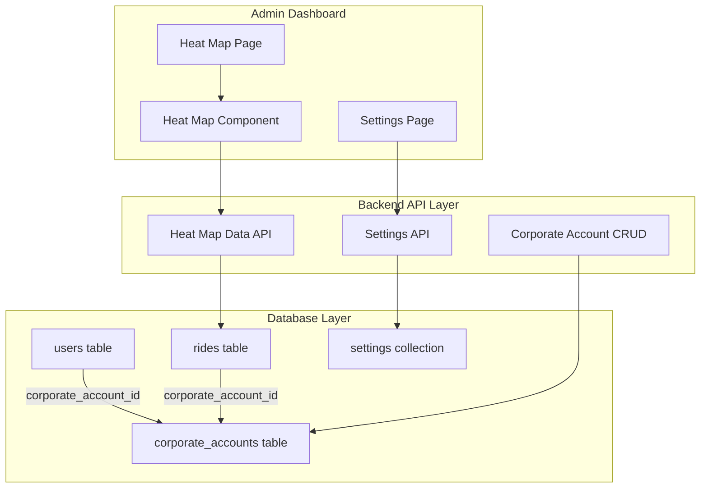
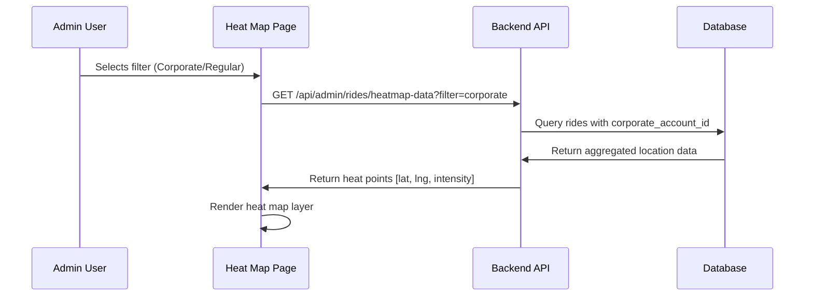

# Heat Map Implementation Plan for Spinr Rideshare Platform

## Overview

This plan outlines the implementation of a comprehensive heat map system in the admin dashboard that displays ride density patterns, with separate views for corporate accounts and regular riders, following rideshare industry standards.

## Architecture



## Heat Map Data Flow



## Implementation Steps

### Phase 1: Database Schema

#### 1.1 Create corporate_accounts Table

```sql
CREATE TABLE IF NOT EXISTS corporate_accounts (
    id              TEXT PRIMARY KEY,
    company_name    TEXT NOT NULL,
    contact_email   TEXT NOT NULL,
    contact_phone   TEXT,
    account_type    TEXT NOT NULL DEFAULT 'standard',  -- standard | premium | enterprise
    discount_percentage FLOAT NOT NULL DEFAULT 0,
    is_active       BOOLEAN NOT NULL DEFAULT TRUE,
    created_at      TIMESTAMPTZ NOT NULL DEFAULT NOW(),
    updated_at      TIMESTAMPTZ NOT NULL DEFAULT NOW()
);

CREATE INDEX idx_corporate_active ON corporate_accounts (is_active);
```

#### 1.2 Add corporate_account_id to users Table

```sql
ALTER TABLE users ADD COLUMN corporate_account_id TEXT REFERENCES corporate_accounts(id);
CREATE INDEX idx_users_corporate ON users (corporate_account_id);
```

#### 1.3 Add corporate_account_id to rides Table

```sql
ALTER TABLE rides ADD COLUMN corporate_account_id TEXT REFERENCES corporate_accounts(id);
CREATE INDEX idx_rides_corporate ON rides (corporate_account_id);
```

### Phase 2: Backend API Endpoints

#### 2.1 Corporate Accounts CRUD

| Method | Endpoint | Description |
|--------|----------|-------------|
| GET | /api/admin/corporate-accounts | List all corporate accounts |
| POST | /api/admin/corporate-accounts | Create new corporate account |
| PUT | /api/admin/corporate-accounts/{id} | Update corporate account |
| DELETE | /api/admin/corporate-accounts/{id} | Delete corporate account |

#### 2.2 Heat Map Data Endpoint

```
GET /api/admin/rides/heatmap-data

Query Parameters:
- filter: "all" | "corporate" | "regular"
- start_date: ISO date string
- end_date: ISO date string
- service_area_id: string (optional)
- group_by: "pickup" | "dropoff" | "both"

Response:
{
    "pickup_points": [[lat, lng, intensity], ...],
    "dropoff_points": [[lat, lng, intensity], ...],
    "stats": {
        "total_rides": 1000,
        "corporate_rides": 300,
        "regular_rides": 700
    }
}
```

#### 2.3 Settings for Heat Map Configuration

```python
HEAT_MAP_SETTINGS = {
    "heat_map_default_range": "30d",  # 7d, 30d, 90d, 1y
    "heat_map_intensity": "medium",    # low, medium, high
    "heat_map_radius": 25,              # pixels
    "heat_map_blur": 15,                # pixels
    "heat_map_gradient_start": "#00ff00",  # green
    "heat_map_gradient_mid": "#ffff00",    # yellow
    "heat_map_gradient_end": "#ff0000",    # red
    "heat_map_show_pickups": True,
    "heat_map_show_dropoffs": True
}
```

### Phase 3: Admin Dashboard Components

#### 3.1 New Heat Map Page Structure

```
/dashboard/heatmap/page.tsx
```

**Features:**
- Filter bar with toggle: All | Corporate | Regular
- Date range picker (preset: Today, 7 days, 30 days, 90 days, Custom)
- Service area dropdown filter
- Toggle: Show Pickups | Show Dropoffs
- Heat intensity slider
- Full-screen map view
- Stats summary card

#### 3.2 Heat Map Component

```typescript
interface HeatMapProps {
    pickupPoints: [number, number, number][];
    dropoffPoints: [number, number, number][];
    settings: HeatMapSettings;
    serviceAreas: ServiceArea[];
}
```

**Implementation using Leaflet.heat:**
- Use leaflet.heat plugin for heat layer
- Support both pickup and dropoff overlays
- Configurable radius, blur, and gradient
- Cluster toggle for high-density areas

### Phase 4: Admin Settings Integration

Add heat map configuration section to `/dashboard/settings/page.tsx`:

- Default time range dropdown
- Heat intensity preset (Low/Medium/High)
- Custom color gradient picker
- Show/hide toggle for pickups and dropoffs
- Save settings to backend

## Variables Accessible from Admin Panel

| Variable | Type | Default | Description |
|----------|------|---------|-------------|
| heat_map_enabled | boolean | true | Enable/disable heat map feature |
| heat_map_default_range | string | "30d" | Default date range |
| heat_map_intensity | string | "medium" | Heat intensity level |
| heat_map_radius | number | 25 | Heat point radius in pixels |
| heat_map_blur | number | 15 | Blur amount |
| heat_map_gradient_start | string | "#00ff00" | Low intensity color |
| heat_map_gradient_mid | string | "#ffff00" | Medium intensity color |
| heat_map_gradient_end | string | "#ff0000" | High intensity color |
| heat_map_show_pickups | boolean | true | Show pickup heat points |
| heat_map_show_dropoffs | boolean | true | Show dropoff heat points |
| corporate_heat_map_enabled | boolean | true | Enable corporate-specific view |
| regular_rider_heat_map_enabled | boolean | true | Enable regular rider view |

## Corporate vs Regular Rider Tracking

### Corporate Account Features:
- Dedicated heat map view
- Per-company statistics
- Ride volume trends
- Discount tracking
- Employee ride aggregation

### Regular Rider Features:
- Standard heat map view
- Overall platform demand patterns
- Peak hours analysis
- Service area coverage

## Rideshare Industry Standard Features

Following Uber/Lyft corporate standards:

1. **Demand Hotspots**: Identify high-demand pickup areas
2. **Supply Patterns**: Track driver availability zones
3. **Airport vs City**: Separate heat maps for different zone types
4. **Time-based Analysis**: Historical heat map playback
5. **Multi-layer Support**: Toggle between pickup/dropoff overlays

## Files to Create/Modify

### New Files:
- `spinr/backend/migrations/add_corporate_accounts.sql`
- `spinr/admin-dashboard/src/app/dashboard/heatmap/page.tsx`
- `spinr/admin-dashboard/src/components/heat-map.tsx`

### Modified Files:
- `spinr/backend/server.py` - Add API endpoints
- `spinr/admin-dashboard/src/lib/api.ts` - Add API functions
- `spinr/admin-dashboard/src/app/dashboard/settings/page.tsx` - Add heat map settings
- `spinr/admin-dashboard/src/components/sidebar.tsx` - Add heat map nav item

## Testing Strategy

1. **Unit Tests**: Test API endpoints with mock data
2. **Integration Tests**: Test heat map data aggregation
3. **UI Tests**: Test filter interactions and map rendering
4. **Performance Tests**: Verify heat map renders with 10k+ points

## Success Criteria

- [ ] Admin can view heat map showing all rides
- [ ] Admin can filter to show only corporate rides
- [ ] Admin can filter to show only regular rider rides
- [ ] Admin can configure map settings
- [ ] Settings heat persist across sessions
- [ ] Heat map renders smoothly with large datasets
- [ ] Separate statistics shown for corporate vs regular
